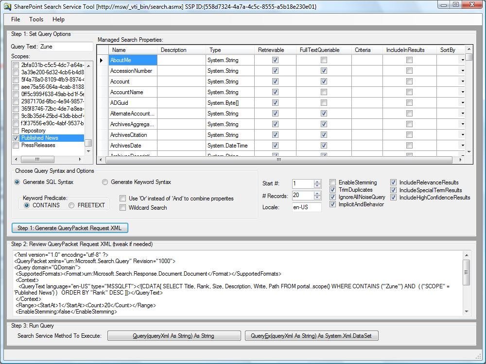
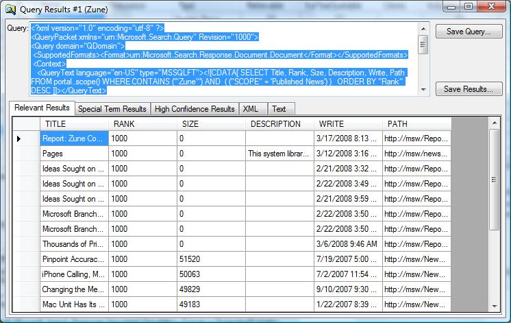

**Note**
There is now an enhanced generation of this tool available which targets the FAST Search Server 2010 for SharePoint.
Go to the "FAST for Sharepoint MOSS 2010 Query Tool" project at [http://fastforsharepoint.codeplex.com/](http://fastforsharepoint.codeplex.com/)

**Project Description**
The SharePoint Search Service Tool is a rich web service client that allows a developer to explore the scopes and managed properties of a given SharePoint Search SSP, build queries in either Keyword or SQL Syntax, submit those queries and examine the raw web service results.  This tool can be useful in troubleshooting and verifying the behavior and configuration of a SharePoint environment.

The SharePoint Search Service Tool is an evolution of a tool that used to be available back on GotDotNet moons ago that was called the MOSSQueryTool.  Because the tool has been enhanced and should work with all SharePoint Search products, it has been renamed for its initial public release.

The UI of the tool consists primarily of two parts.
**Main Window**
Here you specify which scopes, keywords, and property filters to include in your query, generate the query and execute it.

**Results Window**
Here you get a recap of the query that was executed, and a rendering of the web service results.  If you run the Query method, the results are shown as formatted XML, and if run as QueryEx the results are a dataset, so are loaded into a DataGridView.  You can save the query to a file for later use within the tool and/or save the results to a file.

## Related Projects
* [http://www.codeplex.com/MOSSSearchCoder](http://www.codeplex.com/MOSSSearchCoder)   Daniel McPherson has a similar but complimentary project that uses just the SharePoint Object Model (OM).  It actually goes so far as to include its own OM for writing search queries, and a code generator.
